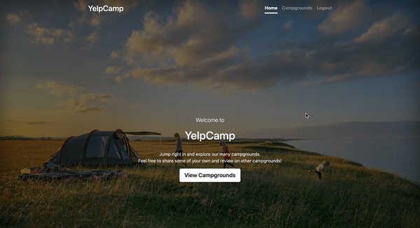

# yelpCamp 🏕
A CRUD application that allows users to share and review campgrounds. An interactive map using MapBox is added to each campground. 

# Demo

## Homepage

## Add a Campground 

## Edit & Delete Campground 

## Add & Delete a Review 

# Getting Started 
1. Fork this repository, then `git clone` your fork of this repository.
2. Install all dependencies using the `npm install` command.
3. Create a `.env` by copying `.env.example` as a reference. 
4. Add in the neccessary configuration in the `.env` file: CLOUDINARY_CLOUD_NAME, 
CLOUDINARY_SECRET, CLOUDINARY_API_KEY, MAPBOX_TOKEN (an account is needed to obtain these configuration).
5. Reseed/Reset Database doing `node seeds/index.js`.
6. Run the server using  `npm start` command.
7. Go to `http://localhost:3000/` on web browser

**Note*: 
To view and connect to the database, MongoDB shell (`mongosh`) must be installed. 
https://www.mongodb.com/docs/mongodb-shell/install/#std-label-mdb-shell-install

# Tech Stack 
- Boostrap 
- Node 
- Express 
- Mapbox 
- Mongoose
- Ejs
- Cloudinary 
- Passport 
- Connect-flash 
- Joi 
- multer 

# Ressources 
This project was based on the Udemy Course "The Web Developer Bootcamp" by Colt Steele. 
Built for learning purposes only. 